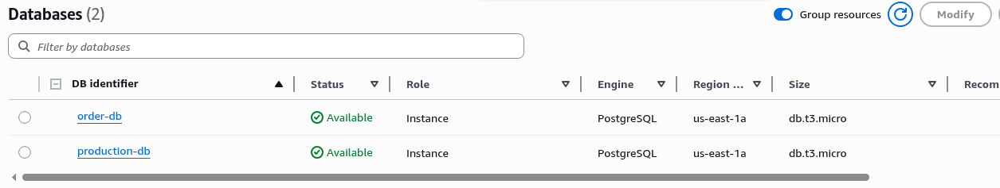
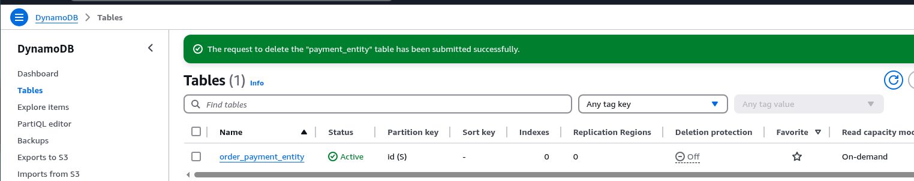
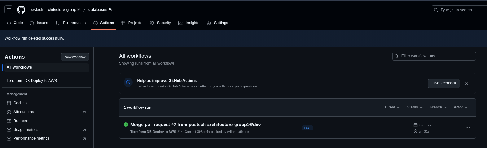

<h3 align="center">Banco de dados - RDS (Postgres) e DynamoDB</h3>

<h3 align="center">Descrição ⚡</h3>

<h3>RDS PostgreSQL é usado para aplicações que precisam de um banco relacional com suporte a transações complexas e SQL avançado.
 
 
DynamoDB é ideal para aplicações que exigem alta escalabilidade, baixa latência e armazenamento de dados NoSQL.<h3>

### 👨‍💼 Desenvolvido por

### RDS Postgres - DynamoDB

 
### Github Actions - Runs

